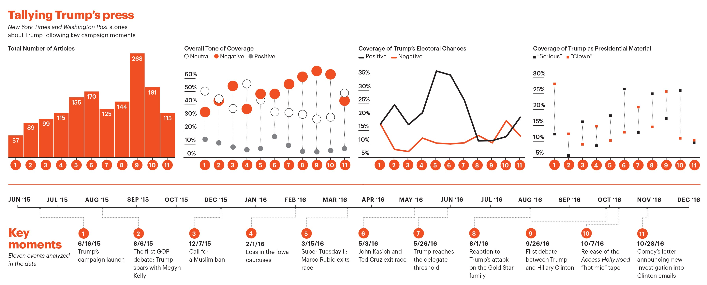
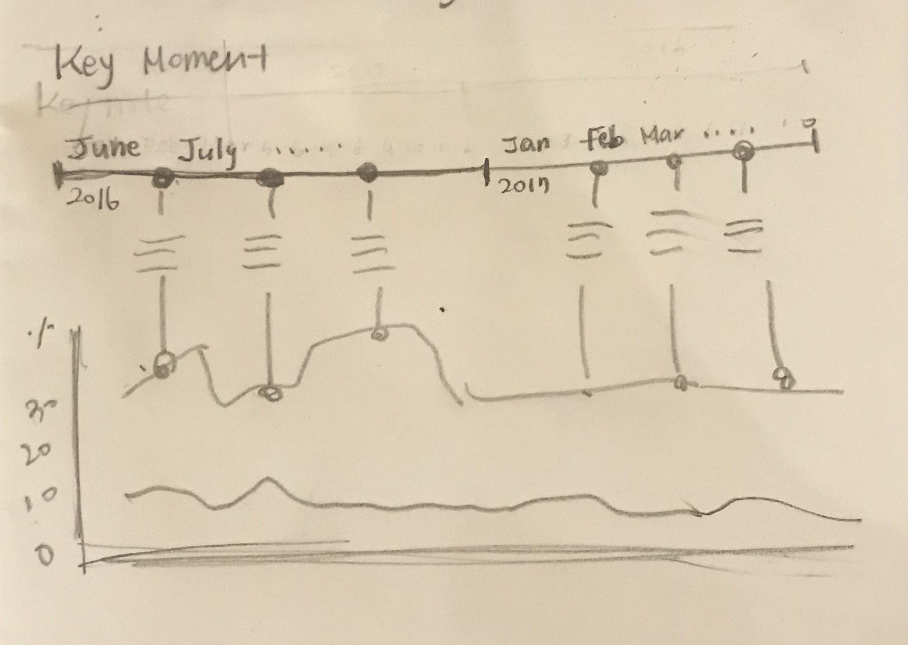

### Assignment 3 & 4: Critique by Design

I am going to critique on a not so bad data visualization, but confusing to interpret the information at glance look written by Regina G. Lawrence and Amber E. Boydstun in Columbia Journalism Review about [The Trump Conundrum](https://www.cjr.org/special_report/trump-coverage-election-clinton.php). 

First of all, I personally enjoy to read the article pretty much.  It was interesting to read the ironical impact of highly negative press in the media. I slapped my knee when I read the last sentence of the article. Here is the quote. "And in the age of the anti-hero, from Tony Soprano to Breaking Bad’s Walter White, just because we are repulsed by entertaining figures doesn’t mean we won’t vote for them."

We have to admit that we were entertained by Donald Trump, now Mr.President, during his 1st presidential campain from 2016 to 2017. No one believed, may be tried not to believe, that an amature politician would become a president of the U.S. Most of us thought that he is a clown who entertains us and would go down to the back stage after the election was over becuase he was unconventional, silly, and even look ridiculous because of not so sophisticated non-political correctness language.  To make things worse, we were embrassed by his extravagant behaviors and treats toward women.  Most importantly, an opponent candidate was demonstrably more experienced and qualified than him. We all know who I am talking about, Mrs.Clinton.  

Although the article(it was so fun to read) is pleasigly entertaining to read, I was disappointed when I saw the graphes(DataViz).  It was all over plaa futile attempt to support the text in a meaningful and somewhat 'interesting to the eye' manner, but it failed to impress. 

Original visualization: 

[source](https://www.cjr.org/special_report/trump-coverage-election-clinton.php)

## Personal Critique
Here is my critique of the DataViz. 5 different graphs are in a small space they all carry different stories to tell.  It is good that the author has a lot to convey messages with data, but it got to fail to entice the reader's attention to focus on one focal point.  If I redesign the graph I would redraw as below; 

- Critique No.1 - Key Moment: Move this to the top of the graph.  Due to the position of the timeline, my eye had to travel ups and downs to compare the upper charts and the tile lines.  I want to make it bigger and make sure that readers are reading the history line before they go down to read the detail. 

- Critique No.2 - Total Number of Article: I like the color and minimal labeling but it is unclear what kind of articles Trump wrote unless the reader read the article about to interpret the graph.  It would have been easier if there's a label on the top of the stick graph.  

- Critique No.3 - Overall Tone of Coverage: I like the way the intention of using the stacking up dot plots chart.  However, it must have been clear if all the circles are in the same size.  It seems the positive side of data got discriminated against to emphasize the negativeness. 

- Critique No.4 - Coverage of Trump's Electoral Chances: Once I read the chart, I questioned to myself, "Why this chart is there? What is the message behind?"  The design of the chart definitely has merit because of its minimal design, however, it lost its function to deliver the message to readers.  

- Critique No.5 - Coverage of Trump as Presidential Material: Although I am not a Trump supporter, this graph offended my feeling right after I read the word "Clown" beside the graph design itself.  Also, the topic of this particular chart does not align with other stories of graphs to my humble opinion.  The graph is easy to read, but it must have been a little easier if there are dotted lines across the background in order to save the eye travel time to interpret the data.  

## Gathering the Data
The article did not seem to show a source for the data, so I created the data. In order to recreate this chart I used excel.  After some fiddling around in excel I was able to create a datasheet which can be manipulated by Tableau. I have a data set, and the next step is to make a draft of my visualization. 

## Wireframe a Solution & Potential Reader's Feedback 
Here is my wireframe work. My intention is to combining three charts on the top raw with the timeline graph at the bottom to save eye traveling. With a new design, I want readers to intuitively acquire complicated data information at glance. 

The Wireframing activity helped me to think of choosing the graph design that like and helped me to fine the initial design by getting the feedback from the readers.  I received the following response:

* Can you tell me what you think this is? I like the way you combined 4 separate charts into one. 
* Can you describe to me what this is telling you?  It is talking about how media interact with Donal Trump based on the key moment during the 2017 president election. 
* Is there anything you find surprising or confusing? Not really. 
* Who do you think is the intended audience for this? New paper subscribers? 
* Is there anything you would change or do differently? Maybe add the number along the line chart.  

The interviee reads news paper everyday, so she pocess a high level of insights in terms of evaluating the DataViz based on the News Article.   

## Prgress of Design Change
* First, the major change the the DataViz was combinidng four graphes into one.  I decided to eliminate the one on the right top because it carries the same information, so I elminated redundancies to achieve minimal look. With these changes, the graph looks cleaner and simple.  The complicated data became more visually appealing data.  
* Second, in order to fit the story of the article, I changed the title and subtitle of the graph. 
* Thrid, I refere the "Timeline Chart in Tableau" [source](https://www.absentdata.com/tableau/timeline-chart-in-tableau/) to create the timeline with the Tableau system.

## Final Work 
Tadah!  

I'm 70% satisfied with the result.  I wish I had more time to refine the data especially combining two graphes into one.
It will be a good self-explatory exercise to explore more about this unknown area. I hope you like my design, thanks for reading!  

XO, Hannah [source](https://www.linkedin.com/in/moonhannah/)
